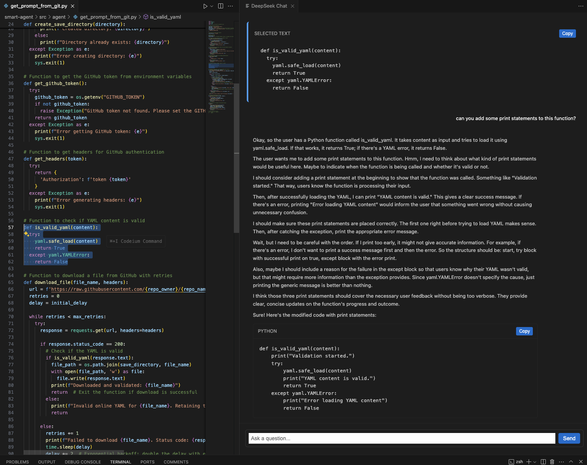

# DeepSeek (personalassistant-ext) VS Code Extension

An AI-powered coding assistant for Visual Studio Code that integrates with Ollama locally. Ask coding questions, get syntax-highlighted answers, and improve your workflow without leaving VS Code!



## Table of Contents
- [Prerequisites](#prerequisites)
  - [Install Ollama](#install-ollama)
  - [Download DeepSeek-R1 Model](#download-deepseek-r1-model)
- [Features](#features)
- [Installation](#installation)
  - [Option A: Install from VSIX](#option-a-install-from-vsix)
  - [Option B: Clone & Build from Source](#option-b-clone--build-from-source)
- [Usage](#usage)
- [Contributing](#contributing)
- [Development](#development)
- [Release Notes](#release-notes)
- [Additional Notes](#additional-notes)

## Prerequisites

### Install Ollama

1. Download and install Ollama from the official [Ollama GitHub repo](https://github.com/ollama/ollama).
2. Verify installation by running:
   ```bash
   ollama version
   ```
   You should see a version number printed.

### Download DeepSeek-R1 Model

Ollama hosts various parameter sizes for the DeepSeek-R1 model, including 1.5B, 7B, 8B, 14B, 32B, 70B, and 671B.
For this extension, I recommend using the 8B version (though any version can work if your system can handle it).

1. Open your terminal and run:
   ```bash
   ollama run deepseek-r1:8b
   ```

2. Verify the model is installed:
   ```bash
   ollama list
   ```
   If you see `deepseek-r1:8b` listed, congratulations—your model is ready!

3. (Optional) Test it directly:
   ```bash
   ollama run deepseek-r1:8b
   ```
   Type a prompt to ensure the model responds locally.

## Features

- **AI Chat Panel**: Quickly open a chat panel with a keyboard shortcut:
  - Mac: `Cmd + E`
  - Windows/Linux: `Ctrl + E`
- **Programming Q&A**: Ask coding questions, get AI-powered responses directly in a WebView panel
- **Syntax Highlighting**: Code snippets are formatted and highlighted automatically
- **Local AI**: Uses Ollama for local large language model inference (no external API calls needed)

## Installation

**Note**: Ensure Ollama is installed and the DeepSeek-R1:8B model is downloaded before proceeding.

### Option A: Install from VSIX

1. Go to the Releases page in this repository
2. Download the latest .vsix file (e.g., `personalassistant-ext-0.0.1.vsix`)
3. In VS Code, open the Extensions panel:
   - Mac: `Cmd + Shift + X`
   - Windows/Linux: `Ctrl + Shift + X`
4. Click on the More Actions (the ... menu) and choose "Install from VSIX..."
5. Select the downloaded .vsix file to install

### Option B: Clone & Build from Source

1. Clone this repository:
   ```bash
   git clone https://github.com/enesbasbug/deepseek-vscode-extension.git
   cd deepseek-vscode-extension
   ```

2. Install dependencies:
   ```bash
   npm install
   ```

3. Build the extension:
   ```bash
   npm run compile
   ```

4. Package the extension (generates a .vsix):
   ```bash
   npx vsce package
   ```

5. In VS Code, "Install from VSIX..." as described above

## Usage

1. Open any project/folder in VS Code
2. You can first select some piece of text and then/or just simply press:
   - Mac: `Cmd + E`
   - Windows/Linux: `Ctrl + E`
3. A chat WebView panel will open
4. Type your programming question or prompt, then press `Enter`
5. The AI (powered by Ollama locally, using DeepSeek-R1) will respond with code snippets highlighted

## Contributing

Contributions are welcome and appreciated! Here's how you can help:

1. Fork the repository
2. Create a feature branch from main (e.g., `git checkout -b feature-new-awesome-thing`)
3. Commit your changes, and push the branch to your fork
4. Submit a Pull Request (PR) describing your changes

I encourage you to open an issue for any bug or feature request before submitting a PR. This helps everyone stay on the same page.

## Development

If you want to develop or debug the extension locally:

1. Clone the repo and install dependencies:
   ```bash
   git clone https://github.com/YOUR_GITHUB_USERNAME/deepseek-vscode-extension.git
   cd deepseek-vscode-extension
   npm install
   ```

2. Open the project in VS Code
3. Press `F5` in VS Code to launch a new Extension Development Host with your extension loaded
4. Modify the code in the `src` folder
5. Use the built-in debugger, console logs, or the WebView Developer Tools to inspect issues

### Linting & Tests:

- Run `npm run lint` to check for code style and syntax issues
- Run `npm test` (or `npm run test`) to execute tests (if configured)

## Release Notes

### 0.0.1
- Initial release with WebView-based chat panel
- Keyboard shortcut (`Cmd + E` / `Ctrl + E`) for quick access

## Additional Notes

- **DeepSeek-R1 Model Sizes**: If your machine's hardware allows, you can experiment with larger or smaller parameter sizes (1.5B, 7B, 14B, 32B, 70B, 671B)
- **Memory Usage**: Larger models require more memory/VRAM. Start with 8B if you're unsure about your system's capabilities